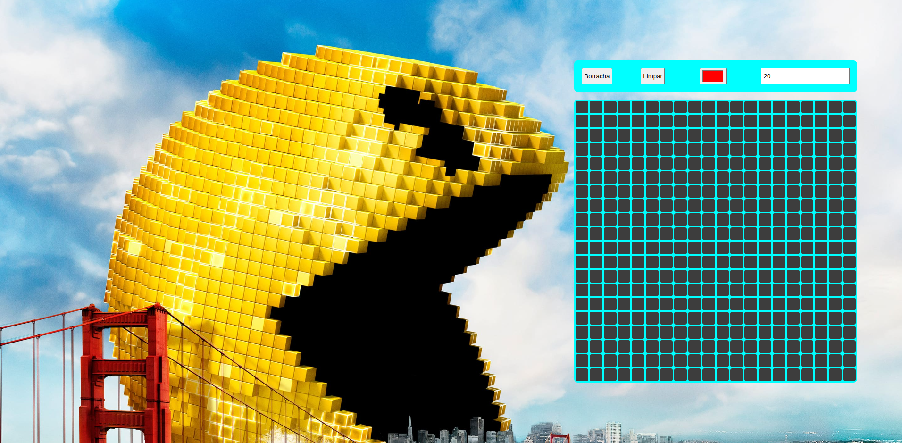

# Pixels Art

- Neste projeto, foi implementado um editor de arte com pixels em que a pessoa usuária poderá escolher uma cor em uma paleta de cores e poderá pintar o que quiser em um quadro branco 🎨 🧑‍🎨

💡 Veja o exemplo a seguir de como o projeto pode se parecer depois de pronto.

## pixel-art

## brinque um pouco com deploy

https://pixels-art-kp69zmu6b-ronaldocerenza.vercel.app/

